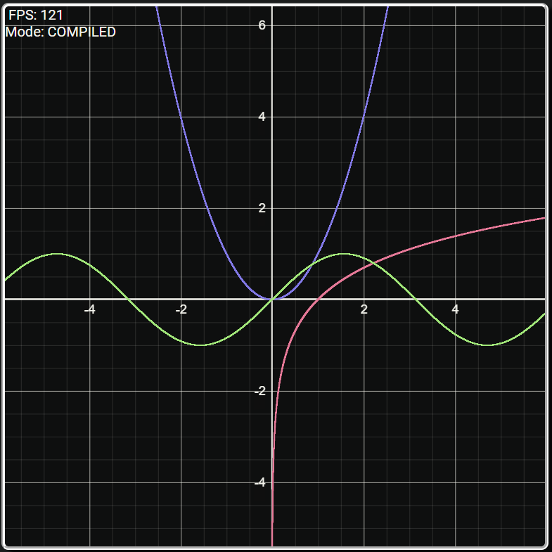

# WebGL Calculator

This project is a graphical calculator made with Tauri that draws the functions using the fragment shader with WebGL2.

It has:
- Graph almost any 2d equation
- Use of one-letter variables and functions
- Derivatives of the functions (using ' after the function name, f'(x) )



# How it works
The user inputs a equation, like in Desmos, an it is send to the backend written in LaTeX, made in Rust. 
Then the Rust Backend compiles the equation and it sends it back to the TS frontend, were it is send to the graphics card, where it is interpreted and graphed in the fragment shader.

It can be drawn in two ways:
### - Compiled mode
  The fragment shader is recompiled every time a expression is changed to execute the instructions in code in the GPU.

### - Interpreted mode
  The fragment shader is compiled only once and the expressions' instructions are sent in a bytecode-like program in a texture. This is usually slower due to a lot of branching in the GPU.

## Tecnologies used
- Tauri
- Rust
- Typescript with Vite
- WebGL2
- MathQuill JS

# How to run
First make sure you have installed on your system everything that is explained [here](https://tauri.app/v1/guides/getting-started/prerequisites)

Execute the command:
```console
git clone https://github.com/dangarcar/webgl-calculator.git
cd webgl-calculator
cargo install tauri-cli
npm install
cargo tauri build
```

Now execute the webgl-calculator executable located in `src-tauri/target/release`

> [!NOTE]
> To change between the two render modes, press the Esc key
